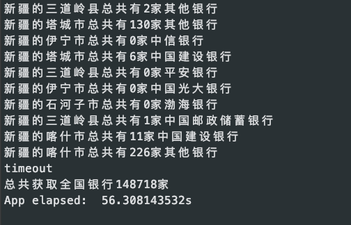

# bank-unioncode-go
Go爬取全国联行号并导出excel,目前只支持河北银行对外公布的联行号网站爬取，后面可选择增多爬取渠道。

## 背景
银行联行号就是一个地区银行的唯一识别标志。用于人民银行所组织的大额支付系统\小额支付系统\城市商业银行银行汇票系统\全国支票影像系统（含一些城市的同城票据自动清分系统）等跨区域支付结算业务。由12位组成：3位银行代码+4位城市代码+4位银行编号+1位校验位。
  所以一些支付机构或者对接跨行转账等业务需要知道对方行的联行号才能进行转账业务。
## 特性
目前只爬取河北银行对外公布的查询联行号网站，后面有需要可以爬取更多的渠道。
## 安装运行
可更改unioncode.go 下面的fileDir变量改变csv存储的位置，默认在"/tmp/unioncode.csv"下
```
go run ./
```
## 运行结果

## 额外
2019-09-01 爬取<a href="">最新csv</a>
<a href="https://github.com/jetman13/bankCode">java版本</a>
